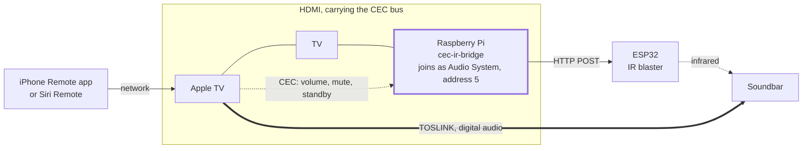

# cec-ir-bridge

[](https://github.com/mjaksn/cec-ir-bridge/actions/workflows/ci.yml)
[](https://github.com/mjaksn/cec-ir-bridge/releases/latest)
[](https://github.com/mjaksn/cec-ir-bridge/blob/main/LICENSE)

Control a legacy IR-only soundbar from the Apple TV Remote app on your
iPhone, without giving up a digital (TOSLINK) audio path.

A Raspberry Pi plugged into any spare HDMI input on the TV registers on
the HDMI-CEC bus as an **Audio System**. When the Apple TV sees an audio
system on the bus, the volume buttons in the iPhone Remote app (and on
the Siri Remote) come alive and send CEC volume/mute commands to it.
This bridge receives those commands and fires HTTP requests at an
ESP32-based IR blaster, which transmits the soundbar's IR codes.

Audio never touches the Pi. It keeps flowing Apple TV -> TOSLINK ->
soundbar, so there is zero quality loss.



Plain lines are cables. Dotted lines are signals with no cable of their
own: the CEC frames ride the HDMI wiring, and the IR crosses the room.
The thick line is the audio, which goes straight from the Apple TV to the
soundbar and never touches the Pi.

Note what the Pi is not plugged into. It has no connection to the Apple
TV and none to the soundbar, and it never becomes the active source on
the TV. It sits on the shared CEC bus, answers to the address an audio
system would answer to, and turns what it hears there into HTTP.

## Hardware

- Raspberry Pi with a free HDMI port on the TV (a Zero 2 W is plenty;
  the Pi's HDMI port has native CEC support, no adapter hardware needed)
- ESP32 (or similar) with an IR transmitter, running firmware that
  exposes HTTP endpoints which transmit your soundbar's volume up,
  volume down, and mute IR codes
- An HDMI cable (plus a mini-HDMI adapter for a Pi Zero)

The Pi only needs to join the CEC bus. Nothing has to "watch" its HDMI
input, and it needs no connection to the Apple TV or soundbar.

## Install

On a fresh Raspberry Pi OS Lite (Trixie or Bookworm), from the latest
release:

```bash
curl -fsSL -o cec-ir-bridge.tar.gz   https://github.com/mjaksn/cec-ir-bridge/releases/latest/download/cec-ir-bridge.tar.gz
tar -xzf cec-ir-bridge.tar.gz
cd cec-ir-bridge-*
sudo ./install.sh http://<esp32-ip-or-hostname>
```

Or from a clone, which is the same installer against whatever `main`
currently holds:

```bash
git clone https://github.com/mjaksn/cec-ir-bridge.git
cd cec-ir-bridge
sudo ./install.sh http://<esp32-ip-or-hostname>
```

The installer:

1. Installs `cec-utils`, `v4l-utils`, and `curl`
2. Writes `/etc/cec-ir-bridge.conf` (from `cec-ir-bridge.conf.example`,
   preserved on re-install)
3. Installs the bridge to `/usr/local/bin/cec-ir-bridge`
4. Installs, enables, and starts the `cec-ir-bridge` systemd service

Then on the Apple TV: **Settings -> Remotes and Devices -> Volume
Control -> Auto**. Toggle the setting or restart the Apple TV once so it
re-scans the CEC bus and discovers the new "Soundbar" audio system. Make
sure the TV is on the first time you test, since the Pi cannot obtain a
CEC physical address until it reads EDID from the TV.

## Configure

Edit `/etc/cec-ir-bridge.conf`:

| Setting | Default | Purpose |
|---|---|---|
| `ESP32_BASE_URL` | (set at install) | Base URL of the IR blaster |
| `VOLUME_UP_PATH` | `/button/volume_up/press` | Endpoint for volume up IR |
| `VOLUME_DOWN_PATH` | `/button/volume_down/press` | Endpoint for volume down IR |
| `MUTE_PATH` | `/button/mute/press` | Endpoint for mute IR |
| `POWER_OFF_PATH` | empty (disabled) | Fired on CEC standby broadcast |
| `POWER_ON_PATH` | empty (disabled) | Fired on CEC wake (Image/Text View On) |
| `MUTE_IGNORE_INITIATORS` | `0` (the TV) | Initiators whose mute commands are ignored |
| `VOLUME_IGNORE_INITIATORS` | empty | Initiators whose volume commands are ignored |
| `POWER_IGNORE_INITIATORS` | empty | Initiators whose power commands are ignored |
| `OSD_NAME` | `Soundbar` | Name shown to other CEC devices |
| `ENGINE` | `cec-client` | CEC backend, see below |

Apply changes with `sudo systemctl restart cec-ir-bridge`.

The optional power paths let the soundbar follow the rest of the system:
when the Apple TV sleeps everything via CEC, the bridge can fire the
soundbar's power IR code too.

### Filtering by initiator

Every CEC frame carries the logical address of the device that sent it,
and the bridge decodes it so commands can be accepted from one device
and ignored from another. Addresses are given in decimal, comma or space
separated: `0` is the TV, `4`, `8`, and `11` are playback devices such as
an Apple TV, and `5` is the audio system.

This exists because some TVs emit a spurious mute when powering off and
send no matching unmute on power on. Since IR mute is usually a toggle
and the bridge has no feedback from the soundbar, that stray command
leaves the soundbar silently muted until someone notices. Ignoring mute
from the TV (the default) fixes it while keeping mute working from the
Apple TV. Ignored events still appear in the log, so filtering never
hides bus activity from you.

## CEC engines

Two backends are included:

- **`cec-client`** (default): libcec. The bridge parses raw TRAFFIC
  frames (for example `>> 05:44:41` is User Control Pressed, Volume Up),
  which is deterministic and avoids double-triggering on libcec's
  human-readable log lines.
- **`cec-ctl`**: the kernel CEC framework tool from `v4l-utils`. libcec
  is in maintenance mode and Raspberry Pi engineers point people toward
  the kernel API, so if `cec-client` cannot find `/dev/cec0` on your
  image, set `ENGINE="cec-ctl"` and restart the service.

## Debugging

Watch recognized CEC events and the HTTP calls they trigger:

```bash
journalctl -u cec-ir-bridge -f
```

Check which version is installed, which is worth doing before anything
else if the machine has been through more than one install:

```bash
cec-ir-bridge --version
```

Pressing volume in the iPhone Remote app should immediately print a line
like `CEC: volume up from initiator 4 -> http://192.168.1.50/volup`, and
filtered events print as `CEC: mute from initiator 0 ignored`. If nothing
appears, the Apple TV has not adopted the Pi as its audio system yet;
re-toggle the Volume Control setting, restart the Apple TV, or inspect
the bus:

```bash
echo scan | cec-client -s -d 1        # list devices on the CEC bus
cec-ctl -d /dev/cec0                  # kernel view of the adapter
```

## Development

```bash
tests/run.sh          # the whole suite
scripts/build.sh      # the release tarball, into dist/
```

The suite needs no CEC adapter, no Raspberry Pi, no ESP32 and no network.
Both engines are driven from recorded captures, `curl` is replaced by a
stub that records the URL and the method, and the installer runs into a
temporary directory with `apt-get` and `systemctl` stubbed. It is safe to
run on a development machine.

`AGENTS.md` has the rest: what the tooling enforces, and the handful of
things about CEC and about the installer that are easy to get wrong.

## Notes and limitations

- Each CEC volume press fires one HTTP call, and calls run in the
  background so held buttons do not queue latency. If hold-to-ramp feels
  slow, have the ESP32 send a short burst of IR repeats per call, or add
  start/stop repeat endpoints and extend the bridge's handling of key
  release frames.
- The Apple TV only sends relative volume steps, so the bridge does not
  track absolute volume. The on-screen volume HUD may look static; the
  soundbar itself is the source of truth.
- TV CEC implementations are quirky. If the TV pops up an "audio system
  connected" notification or changes its speaker routing, check its
  audio/CEC settings. The Pi never declares itself an active source, so
  it should not steal the screen.
